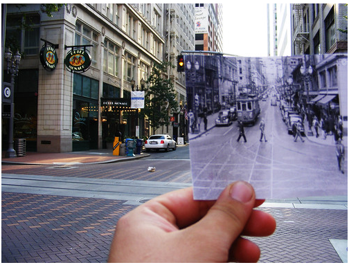
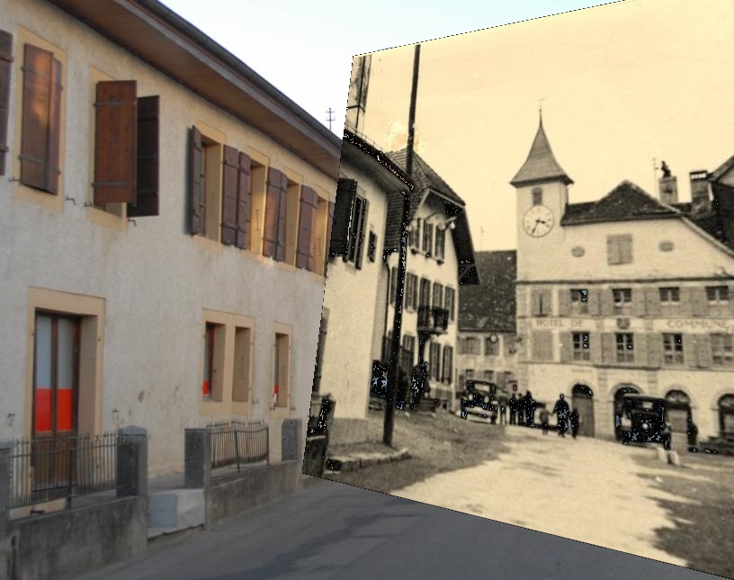
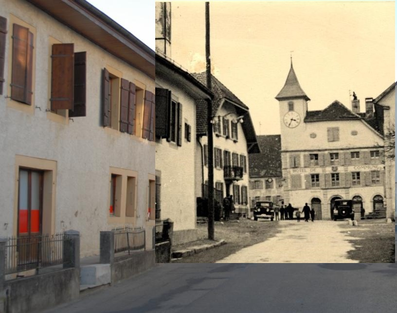
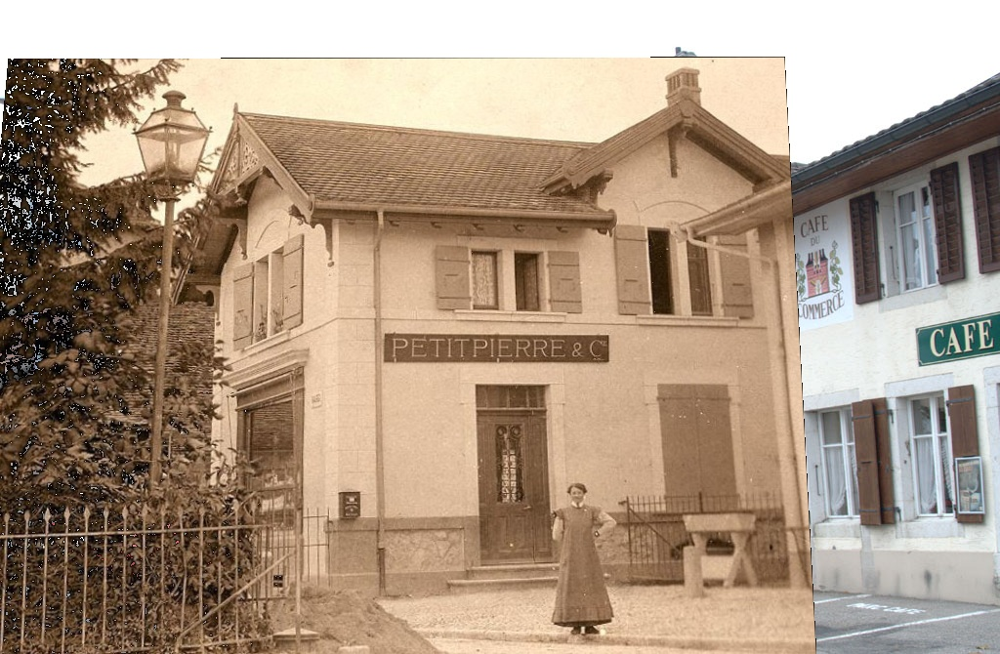
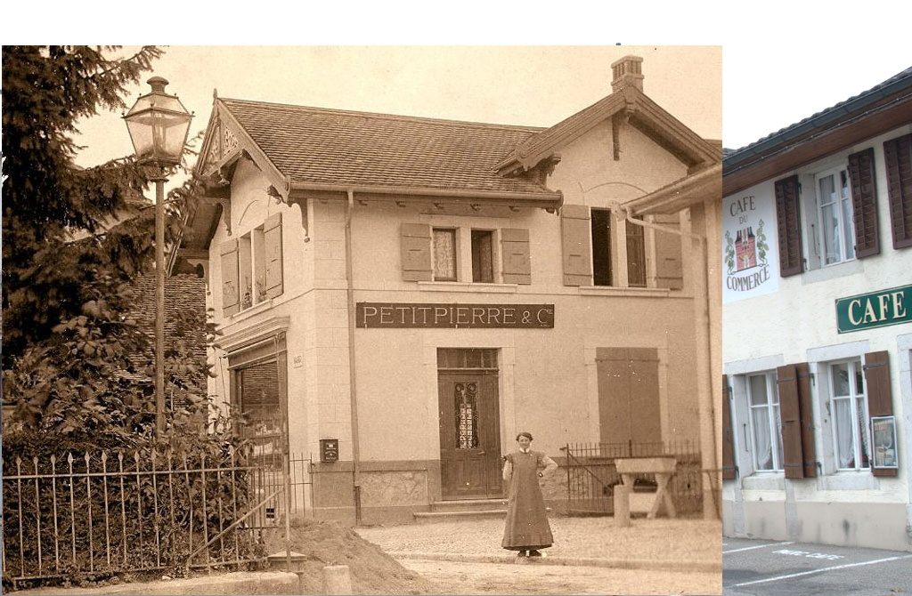

[](https://classroom.github.com/online_ide?assignment_repo_id=6448034&assignment_repo_type=AssignmentRepo)
# 基于 SIFT 和 OTSU 阈值分割的图像配准
成员及分工
* 吴可芃 PB18151858
    * 调研，报告，SIFT配准
* 李汪楷 PB18151848
    * 调研，报告，OTSU配准

## 问题描述
* 目前有很多流行的功能如老照片修复等都是为了让过去重现，本题 "look into the past" 旨在让过去与现实重叠，让老照片嵌入新场景。
* 本项目从网络中搜集了一些新老照片对用于展示基本的配准和嵌入功能。
* 这个问题是经典的图像配准问题，可以用传统的特征匹配如 SIFT 算法或者使用神经网络进行拟合，但是考虑到硬件和数据集不足的问题，所以使用的是传统算法。我们比较了使用特征点对进行配准，和使用OTSU阈值化后进行相关匹配两种方法并进行比较。
<div align="center">  
</div>

## 原理分析
#### SIFT提取特征+RANSAC变换
主要实现四个步骤：
1. 特征点提取
2. 特征点匹配
3. 使用匹配点对获得仿射变换
4. 图像嵌入
##### SIFT
SIFT算法可以分解为如下几个步骤
1. 尺度空间极值检测：搜索所有尺度上的图像位置。通过高斯微分函数来识别潜在的对于尺度和旋转不变的兴趣点。
2. 关键点定位：在每个候选的位置上，通过一个拟合精细的模型来确定位置和尺度。关键点的选择依据于它们的稳定程度。
3. 方向确定：基于图像局部的梯度方向，分配给每个关键点位置一个或多个方向。所有后面的对图像数据的操作都相对于关键点的方向、尺度和位置进行变换，从而提供对于这些变换的不变性。
4. 关键点描述：在每个关键点周围的邻域内，在选定的尺度上测量图像局部的梯度。这些梯度被变换成一种表示，这种表示允许比较大的局部形状的变形和光照变化。

##### RANSAC
RANSAC核心思想就是随机性和假设性，随机性用于减少计算，循环次数是利用正确数据出现的概率。而假设性，就是说随机抽出来的数据都认为是正确的，并以此去计算其他点，获得其他满足变换关系的点，然后利用投票机制，选出获票最多的那一个变换。

#### OTSU + 相关匹配
考虑到数据集中的新老照片对具有相同的视角和分辨率，因此对于裁剪后的老照片，可以在新照片上遍历相同大小的滑动窗口，然后计算两个图片的相关性，相关最大的位置即为匹配点位，并且不用考虑仿射变换。为了减少计算复杂度，本实验的想法为直接对图片进行灰度转换和OTSU阈值处理，对处理后的二值化图片计算相关只需要对同样像素值的点个数进行求和即可。
##### OSTU
基于统计测度，选出的阈值使得类间方差最大化。
类间方差定义为
$$
\begin{align*}
\delta^2_B&=P_1(m_1-m_G)^2+P_2(m_2-m_G)^2\\
&=P_1P_2(m_1+m_2)^2\\
&=\frac{m_GP_1-m}{P_1(1-P_1)}
\end{align*}
$$
最后一式中，P1和m的表达式如下
$$
P_1(k)=\sum_{i=0}^{k}p_i \ \ \ \ m(k)=\sum_{i=0}^{k}ip_i
$$    
这样，只需算出P1与m在每一灰度的值，就可以计算出每一阈值对应的类间方差。

总的步骤如下：
1. 计算图像的直方图，并归一化，用pi表示每一灰度分量占比。
2. 分别计算累计和P1(k)和累计均值m(k)。
3. 计算全局灰度均值mG。
4. 计算每一灰度阈值对应的类间方差。
5. 求得使类间方差最大的阈值k。
6. 用该阈值进行图像分割。

在进行阈值分割前，可以对图像进行降噪处理，根据噪声的不同选择不同的滤波器（如均值滤波、频率滤波等），本次实验只是简单的直接进行阈值分割，并将所得结果进行相关匹配。
##### 相关匹配
相关匹配的思想比较简单，对于给定的待匹配模式（本次实验为裁剪后的老照片），在匹配背景图片（本次实验为新照片）上进行同大小的滑动窗口遍历，计算两者间的相关，选取相关值最大的位置进行配准。由于图片已经进行了二值化处理，故直接计算像素值相等的点数即可，可以大幅减少计算复杂度。
## 代码实现
#### SIFT+RANSAC
特征提取和筛选好的匹配对，这里阈值设为 `0.75` 来过滤一部分错误匹配，因为数据比较模糊的原因本身的匹配点对就不是很多。
```py
# create SIFT and detect key points
surf = cv2.SIFT_create()
kp1, description1 = surf.detectAndCompute(img1gauss, None)
kp2, description2 = surf.detectAndCompute(img2gauss, None)

FLANN_INDEX_KDTREE = 0
indexParams = dict(algorithm=FLANN_INDEX_KDTREE, trees=5)
searchParams = dict(checks=50)

flann = cv2.FlannBasedMatcher(indexParams, searchParams)
match = flann.knnMatch(description1, description2, k=2)

# well matched points
good = []
for i, (m, n) in enumerate(match):
    if m.distance < 0.75*n.distance:
        good.append(m)
```

进行仿射矩阵的计算和仿射变换：
```py
# projection matrix
src_pts = np.float32([kp1[m.queryIdx].pt for m in good]).reshape(-1, 1, 2)
ano_pts = np.float32([kp2[m.trainIdx].pt for m in good]).reshape(-1, 1, 2)
M, mask = cv2.findHomography(src_pts, ano_pts, cv2.RANSAC, 4.0)

# apply projection transform to old picture
warpImg = cv2.warpPerspective(img1, M, (img1.shape[1]+img2.shape[1], img1.shape[0]+img2.shape[0]))
```
#### OTSU + 相关匹配
阈值分割
```py
img1gray=cv2.cvtColor(img1,cv2.COLOR_BGR2GRAY)
img2gray=cv2.cvtColor(img2,cv2.COLOR_BGR2GRAY)
ret1,im1=cv2.threshold(img1gray, 0 ,255 , cv2.THRESH_BINARY+cv2.THRESH_OTSU)
ret2,im2=cv2.threshold(img2gray, 0 ,255 , cv2.THRESH_BINARY+cv2.THRESH_OTSU)
```
相关匹配
```py
maxn=0
tempi=0
tempj=0
for i in range(m-m1):
    for j in range(n-n1):
        s=np.sum(im1==im2[i:i+m1,j:j+n1])
        if s>maxn:
            maxn=s
            tempi=i
            tempj=j
img2[tempi:tempi+m1,tempj:tempj+n1,:]=img1
return img2
```
## 效果展示
左边为SIFT配准结果，右边为OTSU相关匹配结果
<div>
<center class="half">
  
<center>


<center class="half">
  
</div>

可以看到泛黄的老照片完美地嵌入了新场景，非常有意思。

## 工程结构
```dart
PROJECT-TEAMSALTYFISH
|   README.md
|   env.yaml
|   pip.txt
+---figs
|       01_now.jpg
|       01_then.jpg
|       01_then_cropped.jpg
|       ...
|       28_then_cropped.jpg
|
+---results
|       01_otsu.jpg
|       ...
|       28_otus.jpg
|
+---src
|       OTSU.py
|       SIFT.py
|
\---utils
        crawler.py
        cropper.py
```

## 运行说明
环境配置
```bash
conda env create -f env.yaml
conda activate env & :: source activate env
pip install -r pip.txt
```
运行
```bash
python SIFT.py
python OTSU.py
```
